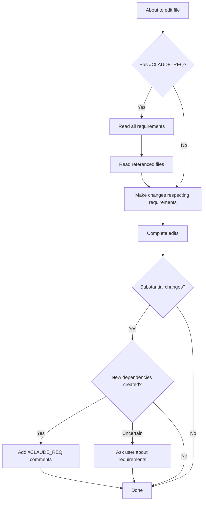

# Claude Code Instructions for The Reserve Automation

This file contains permanent instructions for Claude Code when working with this codebase.

## Adding New Routes — Mandatory Auth Checklist

**Every new route or router MUST have permission enforcement. No exceptions except `/health`.**

When adding a new route file or router:

1. **Router-level auth** (preferred) — set on the `APIRouter` itself so it applies to all routes automatically:
   ```python
   router = APIRouter(dependencies=[Depends(require("something.permission"))])
   ```

2. **Per-route auth** — only if routes in the same file need *different* permissions:
   ```python
   @router.get("/foo", dependencies=[Depends(require("foo.view"))])
   ```

3. **Before including in `app.py`** — grep the new file to confirm:
   ```bash
   grep -n "require(" src/reserve_automation/web/routes/your_new_router.py
   ```

4. **Add the permission to `config/auth.yaml`** — map the new permission to the appropriate roles.

**Why:** Cloudflare Access authenticates every user but does not enforce app-level permissions. An omitted `require()` means any authenticated Google user (guest role) can hit the endpoint. See `config/auth.yaml` for the role hierarchy.

---

## Version Bumping

**CRITICAL: Always use the unified version bump script when bumping versions.**

When the user asks to "bump the version" or "create a new release":

```bash
# Patch version bump (0.3.8 -> 0.3.9) - for bug fixes
./scripts/version-bump.sh patch

# Minor version bump (0.3.8 -> 0.4.0) - for new features
./scripts/version-bump.sh minor

# Major version bump (0.3.8 -> 1.0.0) - for breaking changes
./scripts/version-bump.sh major

# Explicit version
./scripts/version-bump.sh 1.2.3

# Preview changes without applying
./scripts/version-bump.sh --dry-run patch
```

**What this script does:**
1. Updates `pyproject.toml` version
2. Commits the change
3. Creates matching git tag (e.g., `v0.3.9`)
4. Pushes commits AND tags to origin

**DO NOT:**
- Manually edit `pyproject.toml` version
- Create git tags manually (unless explicit one-off need)
- Update version in one place but not the other

**Why:** `pyproject.toml` and git tags must stay in sync. The script ensures both are updated together.

## Documentation Reference Guide

**CRITICAL: Read the appropriate documentation BEFORE starting work on these topics.**

### When to Read Which Documentation

| Scenario | Read This FIRST | Why |
|----------|-----------------|-----|
| **LM Studio / vision / model / upload-extraction** issues | [docs/GROUND_TRUTH.md](docs/GROUND_TRUTH.md) | Non-obvious deployed-system facts (e.g. qwen3.5-9b IS vision-capable; LM Studio needs a Bearer token) — read BEFORE diagnosing |
| **Modifying tests** or creating new tests | [docs/DEVELOPMENT.md](docs/DEVELOPMENT.md) | Complete testing philosophy, protocols, and patterns |
| **Running tests** for a specific system | [docs/TESTING.md](docs/TESTING.md) | Quick reference table for which command to run |
| **Docker deployment** questions | [docs/DEPLOYMENT.md](docs/DEPLOYMENT.md) | Comprehensive Docker setup, networking, troubleshooting |
| **Proxmox deployment** or multi-host setup | [docs/CLAUDE_HANDOFF.md](docs/CLAUDE_HANDOFF.md) | Critical architecture, gotchas, and verification steps |
| **General project info** or user-facing docs | [README.md](README.md) | Overview, features, installation, usage examples |
| **Working with bottle fields** | THIS FILE (CLAUDE.md) | #CLAUDE_REQ system and field coherence workflow |
| **E2E browser tests** | [tests/e2e/TESTING_SAFETY.md](tests/e2e/TESTING_SAFETY.md) | Vault isolation and safety requirements |
| **Event system tests** | [tests/events/README.md](tests/events/README.md) | Event test specifics and known issues |
| **Tasting tests** | [tests/tastings/README.md](tests/tastings/README.md) | Tasting test suites and vault integration |

### Mandatory Reading Triggers

**BEFORE you start ANY of these tasks, you MUST read the corresponding documentation:**

1. **About to modify test files?** → Read docs/DEVELOPMENT.md first
2. **About to run tests?** → Read docs/TESTING.md first (quick reference)
3. **User asks about Docker/deployment?** → Read docs/DEPLOYMENT.md first
4. **User asks about Proxmox setup?** → Read docs/CLAUDE_HANDOFF.md first
5. **About to modify bottle field** (model, template, generator, vault reader)? → Read this file's "CRITICAL: Working with Bottle Fields" section
6. **About to create E2E tests?** → Read tests/e2e/TESTING_SAFETY.md first
7. **About to diagnose an LM Studio / vision / model / upload-extraction problem?** → Read docs/GROUND_TRUTH.md first (it will save you from a known false trail)

### How to Use This Guide

1. **User mentions a topic** → Check the table above
2. **Find the matching scenario** → Note which doc to read
3. **Read that doc FIRST** → Before writing code or making plans
4. **Then proceed** with full context

**Example:**
- User: "Can you help me deploy this to Proxmox?"
- You: *reads docs/CLAUDE_HANDOFF.md and docs/DEPLOYMENT.md first*
- Then: Proceed with deployment assistance using the documented architecture

**Anti-pattern:**
- User: "Can you help me deploy this to Proxmox?"
- You: *immediately starts guessing about deployment without reading docs*
- Result: Mistakes, incorrect assumptions, wasted time

## #CLAUDE_REQ System

This codebase uses a special comment system to document cross-file dependencies and integration requirements that you might not know about without having all the context loaded.

### What are #CLAUDE_REQ comments?

`#CLAUDE_REQ:` comments appear at the top of files and document:
- **Cross-file dependencies**: Files that must stay synchronized (e.g., templates that must match Obsidian templates)
- **Data contract requirements**: Field names, fileClass values, or formats that must match expectations in other systems
- **Naming conventions**: Patterns that affect other parts of the system (e.g., folder naming affecting DataviewJS queries)
- **Integration points**: Where this code interacts with external systems (Obsidian vault, LLM APIs, etc.)

### What #CLAUDE_REQ comments DO NOT document:

- Calculation formulas (these are just code logic - use regular comments)
- Implementation details (standard programming practices)
- Type information or validation rules (these are in the code itself)

### MANDATORY Workflow

#### BEFORE editing a file (or planning file edits):

1. **Check for #CLAUDE_REQ comments**:
   ```bash
   grep -n "#CLAUDE_REQ" <file_path>
   ```
   (Works for all file types - Python, Jinja, Obsidian markdown, etc.)

2. **Read and understand ALL requirements** before making changes

3. **If a requirement mentions another file, read that file** to understand the constraint

4. **Verify your changes won't break the documented requirements**

#### AFTER substantial edits to a file:

1. **Think about whether new #CLAUDE_REQ comments are needed**:
   - Did you add a new integration point?
   - Does this file now depend on another file's structure?
   - Are there field names or formats that must match elsewhere?

2. **If uncertain, ASK THE USER**: "I just made substantial changes to X. Should I add #CLAUDE_REQ comments to document any new cross-file dependencies?"

3. **Add new #CLAUDE_REQ comments** if you identify new requirements

### Example #CLAUDE_REQ Comments

**Python/Jinja files:**
```python
#CLAUDE_REQ: This template MUST match the-reserve/Cellar/9_Templates/Wine Tasting.md - always compare before modifying
#CLAUDE_REQ: fileClass must be "Wine Tasting" (matches DataviewJS queries in bottle templates)
#CLAUDE_REQ: Field names (Appearance, Aroma, Taste) must match Obsidian fileClass definitions
```

**Obsidian markdown files:**
```markdown
%% #CLAUDE_REQ: This template MUST match automation/templates/tasting_wine.md.jinja %%
%% #CLAUDE_REQ: fileClass must be "Wine Tasting" (matches DataviewJS query in Tasting Note.md) %%
%% #CLAUDE_REQ: Field names MUST match 8_FileClass/Wine Tasting.md definition %%
```

Bad examples (these should be regular comments):
```python
#CLAUDE_REQ: AWS Score = sum of all components (this is just a formula)
#CLAUDE_REQ: This function validates user input (this is just what the code does)
```

**Note**: The `#CLAUDE_REQ` marker is universal - just the comment wrapper changes by language:
- Python/Jinja: `#CLAUDE_REQ:`
- Obsidian: `%% #CLAUDE_REQ: %%` (hidden from display)
- JavaScript: `// #CLAUDE_REQ:`

**CRITICAL for Obsidian .md files with frontmatter:**
- FileClass files (8_FileClass/*.md) MUST start with `---` on line 1 (frontmatter)
- Put #CLAUDE_REQ comments AFTER the closing `---`, not before
- Putting comments before frontmatter breaks Obsidian plugins
- Template files (9_Templates/*.md) also start with frontmatter - put REQs after if needed

Always search for just `#CLAUDE_REQ` to find them all!

## When to Check for #CLAUDE_REQ

**ONLY check when you're about to edit a file or create a plan that involves editing files.**

You don't need to track which files have requirements - just check each file as you go to edit it:
1. About to edit `foo.py`? → `grep -n "#CLAUDE_REQ" foo.py` first
2. Planning edits to multiple files? → Check each one before writing the plan
3. Just reading/analyzing? → No need to check

## CRITICAL: Working with Bottle Fields

When adding/modifying ANY field in the bottle data model, you MUST follow this workflow:

### Step 1: Identify the Starting Point
You're modifying one of:
- `core/models.py` (BottleMetadata)
- `the-reserve/Cellar/8_FileClass/*.md` (Obsidian field definitions)
- Templates (`templates/*.md.j2` or `the-reserve/Cellar/9_Templates/*.md`)
- Generator context (`generators/obsidian.py`)
- Vault reader (`utils/vault_reader.py`)
- Field mapping (`web/routes/management.py`)

### Step 2: Read #CLAUDE_REQ in the Starting File
```bash
grep -n "#CLAUDE_REQ" <file_you_are_editing>
```
This will list 4-6 files you MUST verify coherence with.

### Step 3: ACTUALLY GO READ THOSE FILES
For EACH file mentioned in the #CLAUDE_REQ:
1. Use Grep or Read tool to check the file
2. Verify the field exists (or add it if needed)
3. Verify the field name matches (model name vs Obsidian name via field_name_map)

### Step 4: Make Changes to ALL Required Files
Don't just edit the starting file - edit ALL files in the coherence chain:
- If adding `foo` field to BottleMetadata → also add to FileClass, templates, generator context, vault reader, field_name_map
- If renaming field in FileClass → update templates, generator, vault reader, field_name_map

### Example: Adding ABV Field
User says: "Add ABV to wine bottles"

❌ WRONG: Just add to BottleMetadata and say "done"

✅ RIGHT:
1. Read #CLAUDE_REQ in core/models.py → see list of 5 files to check
2. Read 8_FileClass/Wine.md → add ABV field definition
3. Read templates/wine.md.j2 → add ABV to frontmatter
4. Read 9_Templates/Tasting Note.md → add ABV to frontmatter
5. Read generators/obsidian.py _prepare_context → add abv to context dict
6. Read utils/vault_reader.py → add ABV parsing
7. Read web/routes/management.py field_name_map → add "abv": "ABV" mapping
8. THEN say "done"

### The Rule: READ THE #CLAUDE_REQs, THEN DO WHAT THEY SAY
If a #CLAUDE_REQ lists 5 files, you MUST check all 5 files. Not optional.

## Storage Architecture (SQLite)

As of v1.0.0, all data is stored in SQLite (default: `data/reserve.db`) using SQLAlchemy ORM with the repository pattern. The Obsidian vault is no longer the source of truth for the backend.

### Key Components:

1. **Database Engine** (`db/engine.py`): SQLite + WAL mode, session factory, `get_db()` for FastAPI Depends
2. **Models** (`db/models/`): SQLAlchemy ORM models for bottles, tastings, cocktails, ingredients, events
3. **Repositories** (`db/repositories/`): CRUD implementations (e.g., `SQLiteBottleRepository`)
4. **Converters** (`db/converters.py`): SQLAlchemy ↔ Pydantic translation
5. **Import Script** (`scripts/import_vault.py`): One-time vault→DB migration

### Data Flow:
- Routes use FastAPI `Depends(get_bottle_repo)` to get repository instances
- Repositories return Pydantic domain models (e.g., `BottleMetadata`, `Ingredient`)
- Integer primary keys; `str(id)` sent to frontend
- Images stored at `data/media/bottles/{id}/label.jpg`

### Legacy Code (preserved but unused by routes):
- `VaultReader` — kept for the import script
- `ObsidianGenerator` — kept for potential export
- `BottleMatcher` — kept for vault-mode fallback in services
- Jinja2 markdown templates (`templates/*.md.j2`) — unused by routes

### When Working on Data Layer:
- Add new fields to: model (`db/models/`), converter (`db/converters.py`), Pydantic model (`core/`)
- Add new tables: create model, add to `Base.metadata`, create repository
- Tests use in-memory SQLite (`sqlite:///:memory:`) — see `tests/conftest.py`

## Workflow Summary



## Web Server Management

When testing event system changes, I need to restart the web server. The following commands should be whitelisted:

```bash
# Startup script
./start-web.sh
timeout * ./start-web.sh

# Direct uvicorn commands
uv run --env-file .env uvicorn*
WEB_SECRET_KEY=* uv run uvicorn*
timeout * uv run uvicorn*

# Stopping server
pkill -f uvicorn
pkill -f "uvicorn.*reserve_automation"
```

**When to restart:**
- After modifying `routes/events.py` or `routes/tastings.py`
- Before running event tests (to ensure latest code is loaded)

**Startup command:** `./start-web.sh` (runs with reload enabled)

## Testing Protocol

**MANDATORY: Always check for and run tests when modifying code.**

### Test Isolation

All tests use in-memory SQLite (`sqlite:///:memory:`) for isolation. The root `tests/conftest.py` initializes the DB once per session. Each test module seeds its own data via repositories and cleans up afterward.

### E2E Testing Priority

Most bugs come from **frontend/backend integration issues**. Prefer E2E browser tests over unit tests:
1. Tests in `tests/e2e/` run real browsers against real servers
2. They catch integration issues that unit tests miss

### Before Making Changes

1. **Identify which system you're modifying** (events, extraction, vault, web UI, etc.)
2. **Check for existing tests** in `tests/[system]/`
3. **Read test documentation** to understand coverage

### After Making Changes

1. **Run relevant tests** for the system you modified
2. **Verify tests pass** (or document new failures)
3. **Report test results** to the user in your response

### Quick Test Discovery

```bash
# Check for tests related to file you're editing
ls tests/events/        # Event system
ls tests/               # All test directories

# Find tests for a component
grep -r "class Test" tests/ | grep -i "events"
```

### System → Test Mapping

| Modified Files | Run These Tests |
|----------------|-----------------|
| `routes/events.py`, `routes/tastings.py` | `uv run pytest tests/events/ -v` |
| `routes/cocktails.py` | `uv run pytest tests/cocktails/ -v` |
| `routes/ingredients.py` | `uv run pytest tests/ingredients/ -v` |
| `db/` models or repositories | `uv run pytest tests/ -v` |
| `extractors/bottle.py`, `parsers/pdf.py` | `uv run pytest tests/test_bottle_extraction_cli.py -v` |
| Multiple systems | `uv run pytest tests/ -v` |

### If Tests Don't Exist

Alert the user:
> "I'm modifying the [system] but don't see tests in `tests/[system]/`. Should I create a test suite before making changes?"

### Test Result Reporting

Always include in your completion message (adapt to the system you modified):

```
## Tests Run
**System:** [The system you modified - events, extraction, web, etc.]
**Command:** [The actual test command you ran]
**Result:** [Pass/fail status with details]
```

Examples:
- Modified events → "System: Event System, Command: ./tests/events/run_all_tests.sh, Result: 3/4 passing"
- Modified extraction → "System: Bottle Extraction, Command: pytest tests/test_bottle_extraction_cli.py, Result: All passing ✅"
- Modified multiple → "System: Multiple, Command: pytest tests/ -v, Result: 45/46 passing"

**See [docs/DEVELOPMENT.md](docs/DEVELOPMENT.md) for complete testing protocol.**

## Remember

- `#CLAUDE_REQ` comments are for YOU (Claude Code), not for human documentation
- They help maintain consistency across sessions when you don't have full context
- Always grep for them before editing
- Always think about adding them after substantial edits
- When in doubt, ask the user
- **Testing is mandatory** - check for tests before editing, run them after
