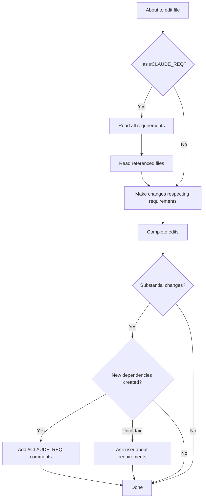

# Claude Code Instructions for The Reserve Automation

This file contains permanent instructions for Claude Code when working with this codebase.

## #CLAUDE_REQ System

This codebase uses a special comment system to document cross-file dependencies and integration requirements that you might not know about without having all the context loaded.

### What are #CLAUDE_REQ comments?

`#CLAUDE_REQ:` comments appear at the top of files and document:
- **Cross-file dependencies**: Files that must stay synchronized (e.g., templates that must match Obsidian templates)
- **Data contract requirements**: Field names, fileClass values, or formats that must match expectations in other systems
- **Naming conventions**: Patterns that affect other parts of the system (e.g., folder naming affecting DataviewJS queries)
- **Integration points**: Where this code interacts with external systems (Obsidian vault, LLM APIs, etc.)

### What #CLAUDE_REQ comments DO NOT document:

- Calculation formulas (these are just code logic - use regular comments)
- Implementation details (standard programming practices)
- Type information or validation rules (these are in the code itself)

### MANDATORY Workflow

#### BEFORE editing a file (or planning file edits):

1. **Check for #CLAUDE_REQ comments**:
   ```bash
   grep -n "#CLAUDE_REQ" <file_path>
   ```
   (Works for all file types - Python, Jinja, Obsidian markdown, etc.)

2. **Read and understand ALL requirements** before making changes

3. **If a requirement mentions another file, read that file** to understand the constraint

4. **Verify your changes won't break the documented requirements**

#### AFTER substantial edits to a file:

1. **Think about whether new #CLAUDE_REQ comments are needed**:
   - Did you add a new integration point?
   - Does this file now depend on another file's structure?
   - Are there field names or formats that must match elsewhere?

2. **If uncertain, ASK THE USER**: "I just made substantial changes to X. Should I add #CLAUDE_REQ comments to document any new cross-file dependencies?"

3. **Add new #CLAUDE_REQ comments** if you identify new requirements

### Example #CLAUDE_REQ Comments

**Python/Jinja files:**
```python
#CLAUDE_REQ: This template MUST match the-reserve/Cellar/9_Templates/Wine Tasting.md - always compare before modifying
#CLAUDE_REQ: fileClass must be "Wine Tasting" (matches DataviewJS queries in bottle templates)
#CLAUDE_REQ: Field names (Appearance, Aroma, Taste) must match Obsidian fileClass definitions
```

**Obsidian markdown files:**
```markdown
%% #CLAUDE_REQ: This template MUST match automation/templates/tasting_wine.md.jinja %%
%% #CLAUDE_REQ: fileClass must be "Wine Tasting" (matches DataviewJS query in Tasting Note.md) %%
%% #CLAUDE_REQ: Field names MUST match 8_FileClass/Wine Tasting.md definition %%
```

Bad examples (these should be regular comments):
```python
#CLAUDE_REQ: AWS Score = sum of all components (this is just a formula)
#CLAUDE_REQ: This function validates user input (this is just what the code does)
```

**Note**: The `#CLAUDE_REQ` marker is universal - just the comment wrapper changes by language:
- Python/Jinja: `#CLAUDE_REQ:`
- Obsidian: `%% #CLAUDE_REQ: %%` (hidden from display)
- JavaScript: `// #CLAUDE_REQ:`

Always search for just `#CLAUDE_REQ` to find them all!

## When to Check for #CLAUDE_REQ

**ONLY check when you're about to edit a file or create a plan that involves editing files.**

You don't need to track which files have requirements - just check each file as you go to edit it:
1. About to edit `foo.py`? → `grep -n "#CLAUDE_REQ" foo.py` first
2. Planning edits to multiple files? → Check each one before writing the plan
3. Just reading/analyzing? → No need to check

## Obsidian Vault Integration

This automation system integrates with an Obsidian vault at `the-reserve/Cellar/`. The vault structure and field names are the source of truth. When in doubt, check the actual Obsidian templates and fileClass definitions.

### Key Integration Points:

1. **Templates**: Automation templates must match Obsidian templates in `the-reserve/Cellar/9_Templates/`
2. **FileClasses**: Field names must match fileClass definitions in `the-reserve/Cellar/8_FileClass/`
3. **Vault Structure**:
   - Wines: `Cellar/1_Wines/{BottleName}/{BottleName}.md`
   - Whiskeys: `Cellar/1_Whiskeys/{BottleName}/{BottleName}.md`
   - Spirits: `Cellar/1_Spirits/{BottleName}/{BottleName}.md`
   - Tastings: Same folder as bottle, named `Tasting-YYYY-MM-DD-TasterName.md`
4. **DataviewJS Queries**: Bottle files contain queries that search for specific fileClass values

### Template Requirements (templates/*.md.j2):

**CRITICAL**:
- Templates MUST start with `---` on line 1 (Obsidian frontmatter delimiter)
- DO NOT add #CLAUDE_REQ comments to template files - they'll appear in generated files and break frontmatter parsing
- The templates are the source of truth - don't modify them unless explicitly requested

### When Working on Vault Integration:

- Read the Obsidian template files BEFORE modifying automation templates
- Test changes by checking if Dataview queries still work in Obsidian
- Verify fileClass values match what queries expect
- Ensure field names match exactly (case-sensitive)

## Workflow Summary



## Remember

- `#CLAUDE_REQ` comments are for YOU (Claude Code), not for human documentation
- They help maintain consistency across sessions when you don't have full context
- Always grep for them before editing
- Always think about adding them after substantial edits
- When in doubt, ask the user
